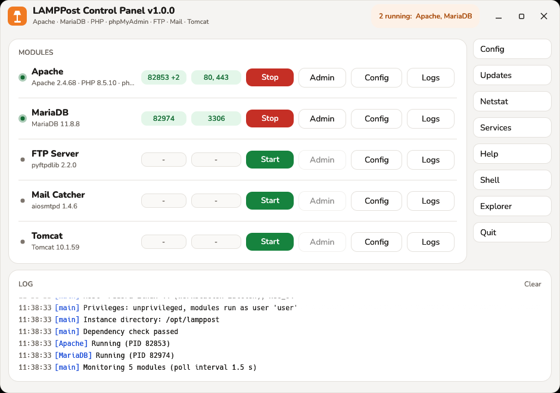
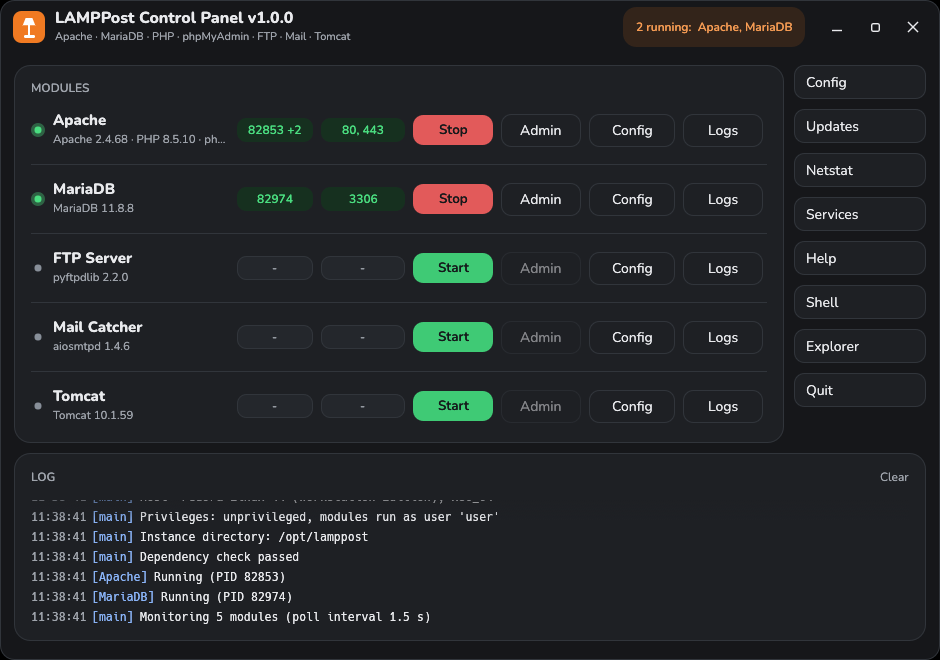
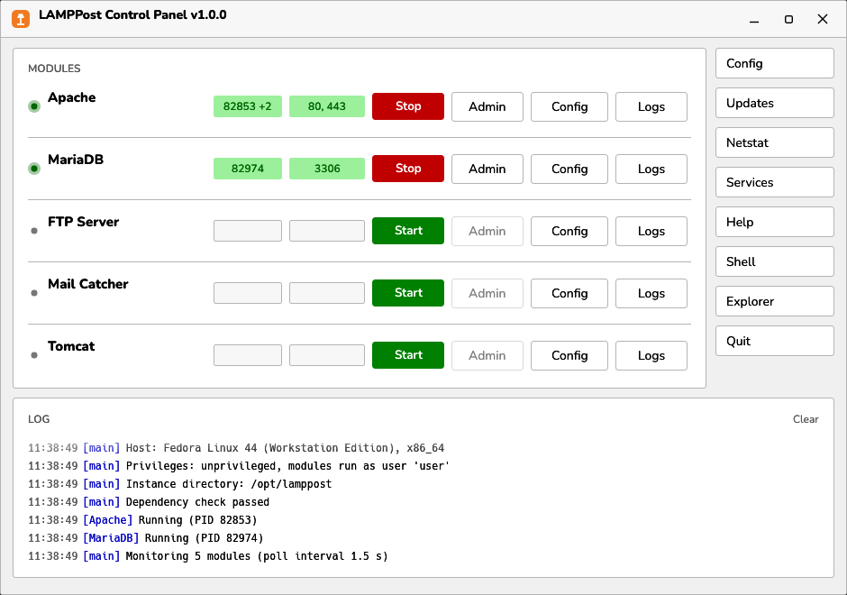
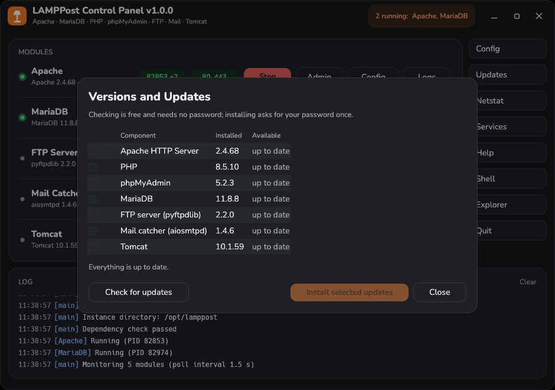

<div align="center">


# LAMPPost

**An XAMPP-style local web stack, built on your distribution's own packages.**

[](LICENSE)
[](https://fedoraproject.org/)
[](https://www.debian.org/)
[](../../releases)

[](https://skillicons.dev)



</div>

## What this is

If you know XAMPP from Windows, you know the idea: one window with Start and
Stop buttons for Apache, a database, FTP, mail and Tomcat, plus a folder where
you drop your PHP files. LAMPPost is that window for Linux.

The difference is what runs underneath. XAMPP ships its own copies of Apache,
MariaDB and PHP, and they are only as current as the next XAMPP release.
LAMPPost ships **none** of them. It starts the packages your system already
has, with its own configuration, its own folders and its own log files, all in
one place. So your local server runs the same up-to-date, security-patched
software as the rest of your machine, and your package manager keeps it that
way.

**No root, no password.** Once it is set up, starting and stopping modules
never asks for a password: every module runs as your own user.

## What you get

| Module | What actually runs | Ports |
|--------|--------------------|-------|
| **Apache** | Apache HTTP Server + PHP-FPM | 80, 443 |
| **MariaDB** | MariaDB server, with phpMyAdmin | 3306 |
| **FTP Server** | pyftpdlib, with its own user list | 21 |
| **Mail Catcher** | aiosmtpd — catches mail instead of sending it, saves it as `.eml` | 25 |
| **Tomcat** | Apache Tomcat | 8080, 8005 |

Everything listens on `127.0.0.1` only, so nothing is reachable from your
network unless you change that yourself.

## Download

Every [release](../../releases) has all three formats. They contain the same
program; pick whichever fits your system.

| Format | For | Install |
|--------|-----|---------|
| **RPM** | Fedora, RHEL | `sudo dnf install ./lamppost-*.rpm` then `lamppost-setup` |
| **DEB** | Debian 13+, Ubuntu 24.04+ | `sudo apt install ./lamppost_*.deb` then `lamppost-setup` |
| **AppImage** | anything else | `chmod +x LAMPPost-*.AppImage` then `./LAMPPost-*.AppImage --setup` |

`lamppost-setup` (or `--setup`) asks for your password once: it installs the
missing packages of your distribution, allows normal programs to use ports from
21 upwards, and creates `/opt/lamppost`. After that, starting and stopping never
needs root; only installing updates or a module's missing packages asks again.

A Flatpak is **not** planned: a sandboxed app cannot start your system's
Apache or install packages, which is the whole point of LAMPPost.

### From source

```bash
git clone https://github.com/Incept0s/lamppost.git
cd lamppost
./install.sh
```

The control panel is a Rust program, so `cargo` is needed to build it (`sudo
dnf install cargo` or `sudo apt install cargo`, or [rustup](https://rustup.rs)
if your distribution's Rust is older than 1.88). Without it everything still
works from the terminal; only the window is missing.

Running `./install.sh` again is safe: it updates the program files and keeps
your configuration, databases and everything in `htdocs`. Add `--force-config`
to regenerate the configuration files (the old ones are kept as `*.bak`).

Log out and back in once after the first install, so the new group membership
takes effect.

## Requirements

* Fedora 42+, Debian 13+, Ubuntu 24.04+ (other distributions may work; the
  package names are detected, not hard-coded)
* A desktop session for the control panel — no Qt, GTK or Python runtime
  needed, the panel is a single 13 MB binary
* About 1.5 GB of disk space for the packages
* For the tray icon on GNOME: the
  [AppIndicator extension](https://extensions.gnome.org/extension/615/appindicator-support/)

## Using it

Open **LAMPPost Control Panel** from the app grid, press **Start** next to
Apache and MariaDB, and open <http://localhost/>.

* **Admin** opens the module (the dashboard, phpMyAdmin, your mail folder).
* **Config** opens its configuration file in your editor.
* **Logs** opens its log file.
* **Updates** shows the installed versions and installs newer ones.
* **Netstat** lists every listening port, shows whether it is reachable from
  the network, and flags programs that block a port LAMPPost needs.
  **Services** shows the distribution's own Apache, MariaDB and Tomcat
  services, which would compete for the same ports.
* If a module's packages are missing (Tomcat, for example, is only a
  recommended package of the `.deb`), **Start** opens a dialog that lists
  exactly which packages it needs and installs them after one password
  prompt. The module starts right afterwards.
* Closing the window leaves LAMPPost in the tray; **Quit** ends the panel
  (running modules keep running, exactly like XAMPP).

Put your website in `/opt/lamppost/htdocs`. It belongs to you, so no `sudo`
when saving files.

### From the terminal

```bash
/opt/lamppost/lamppost start              # Apache + MariaDB
/opt/lamppost/lamppost start ftp mail     # just those two
/opt/lamppost/lamppost stop               # everything
/opt/lamppost/lamppost status
/opt/lamppost/lamppost missing tomcat     # packages a module still needs
/opt/lamppost/lamppost install tomcat     # install them (asks for the password once)
```

XAMPP's module names still work: `mysql`, `filezilla` and `mercury` are
accepted as aliases.

## Where everything lives

```
/opt/lamppost/
    htdocs/                      your websites -> http://localhost/
    apache/conf/httpd.conf       Apache configuration
    apache/logs/                 access_log, error_log
    php/php.ini                  PHP configuration
    php/php                      PHP command line with this php.ini
    mariadb/my.cnf, mariadb/data/  database configuration and data
    mariadb/bin/mysql            database client for LAMPPost's database
    phpMyAdmin/config.inc.php    phpMyAdmin settings -> /phpmyadmin/
    ftp/lamppost-ftp.ini         FTP users and passwords -> ftp://localhost/
    mail/, mailoutput/           mail catcher log, caught mails (*.eml)
    tomcat/                      Tomcat base -> http://localhost:8080/
    lamppost                     command line tool
    lamppost-control             control panel
    distro.sh                    where this system keeps Apache, PHP, MariaDB
```

The layout follows XAMPP's, so tutorials that say "put it in `htdocs`" work
without translation.

## Appearance

The panel draws its own window frame — title bar, buttons and all — so there
is one consistent theme instead of a system title bar above a dark window.
Config › Appearance switches the look while it runs:

* **Modern** — rounded cards, the Nunito font, status lights and the installed
  version under every module. Colours follow your desktop's light/dark
  setting, or you can pin light or dark. Every text colour is checked against
  the WCAG AA contrast ratio (4.5:1).
* **Classic** — the plain grey look of old Windows control panels, for the full
  nostalgia.

<div align="center">


</div>

## Updates

The **Updates** button lists every component with its installed version and
what your distribution currently offers.

Checking costs nothing and needs no password. Installing runs `dnf upgrade` or
`apt-get install --only-upgrade` through `pkexec`, so you confirm once in a
password window. If a module is running while it is being updated, LAMPPost
offers to stop it and start it again afterwards.

<div align="center">

</div>

## Security — please read

LAMPPost is a **development tool for your own computer**. Like XAMPP, it is
configured for convenience, not for the open internet:

* The database user `root` has **no password**, and phpMyAdmin logs in
  automatically. Anyone who can run programs on your machine can read your
  databases.
* PHP shows errors in the browser, and the dashboard exposes `phpinfo()`.
* Every module listens on `127.0.0.1` only. If you change that, you are
  putting an unhardened stack on your network.
* Ports from 21 upwards are opened for normal programs system-wide
  (`net.ipv4.ip_unprivileged_port_start = 21`), so LAMPPost can use port 80
  without root. This also lets any other program of any user bind those ports.
  `./uninstall.sh` puts the limit back to 1024.

Do not run this on a server. To report a security problem, see
[SECURITY.md](SECURITY.md).

## Troubleshooting

**A module will not start, the log says a port is in use.** Something else
owns it — usually a system service or real XAMPP. Check with the **Netstat**
button, then stop the other one: `sudo systemctl stop httpd` (or `apache2`),
or `sudo /opt/lampp/lampp stop` for XAMPP.

**A module says "not installed".** Its packages are missing - on the `.deb`,
Tomcat and phpMyAdmin are only recommended. Press **Start** and confirm the
installation dialog, or run `/opt/lamppost/lamppost install tomcat`.

**phpMyAdmin says it cannot read its configuration.** The `apache` group (on
Debian: `www-data`) is not active in your session yet. Log out and back in
once.

**The tray icon is missing on GNOME.** Install the AppIndicator extension
linked under [Requirements](#requirements).

**XAMPP and LAMPPost at the same time.** They use the same ports, so only one
can run at a time. Both can stay installed.

## How it works

* **No root while running.** A sysctl setting allows normal programs to use
  ports from 21 up, so Apache on port 80 runs as you. There is no setuid helper
  and no polkit rule that could be abused; `/opt/lamppost` belongs to your user.
* **Root only for package installs, and narrowly.** Setup, updates and missing
  packages go through `pkexec` and your package manager. For missing packages
  the privileged step receives module names only and works out the package list
  itself, so nothing else can be slipped in.
* **No bundled servers.** The panel writes configuration files and starts your
  distribution's binaries with them (`httpd -f`, `mariadbd --defaults-file`,
  …). Security updates arrive through your package manager like everything
  else.
* **Distribution differences are detected, not assumed.** `src/distro.sh`
  finds Apache, PHP-FPM, MariaDB, Tomcat and phpMyAdmin wherever the system
  keeps them, and the Apache module list is generated for the Apache you have.
* **The panel is a viewer.** All start/stop logic lives in the `lamppost`
  shell script; the panel calls it and watches PID files and ports. Anything
  the panel can do, you can do from a terminal.
* **The tray icon is its own process.** Closing the window really closes it
  (Wayland does not let a window hide itself), and `lamppost-control --tray`
  keeps LAMPPost in the top bar using about 9 MB, with no graphics stack at
  all. Opening the window from the tray starts it again; **Quit** ends both.

## Project status

Beta, and honest about it.

| | |
|---|---|
| Tested | Fedora 44 (daily use); Debian 13 install, start and on-demand package install in a container before release |
| Should work | RHEL-family and Ubuntu 24.04+, same package layout |
| Packages | RPM, DEB and AppImage, built and linted by CI for every tagged release |
| Not planned | Flatpak (a sandbox cannot control host services), Windows, macOS |

The control panel is written in Rust, which is what makes the single-file
AppImage and the dependency-free packages possible.

## Contributing

Bug reports and patches are welcome — see [CONTRIBUTING.md](CONTRIBUTING.md).
If something in the panel confused you, that is a bug worth reporting too.

## License and trademarks

LAMPPost is MIT licensed — see [LICENSE](LICENSE). Bundled and used
third-party software, and the trademark notices, are listed in
[THIRD-PARTY.md](THIRD-PARTY.md). Every package also carries
`THIRD-PARTY-LICENSES.txt` with the licence notices of all Rust crates compiled
into the control panel.

Short version: XAMPP and Apache Friends are registered trademarks of BitRock.
LAMPPost is an independent project, not affiliated with or endorsed by them,
and contains no XAMPP code. It is inspired by XAMPP's idea and folder layout.
